# *smart-shoppingcart*

*智慧商城项目*

## 0520 Dev-log

### 创建项目

基于 VueCli 自定义创建项目架子

* **安装脚手架**
* **创建项目**
* **选择自定义**

  * Babel / Router / Vuex / CSS / Linter
  * Vue2.x
  * VueRouter hash模式
  * CSS预处理 Less
  * ESLint
  * 配置文件 dedicated config files
  * 

  ---

### 调整初始化目录

1. 删除多余文件
2. 新增 api 与 utils目录

---

### Vant 全部导入

1. **安装 vant-ui**
   * `yarn add vant@latest-v2 `
2. **main.js中注册**
   ```
   import Vant from 'vant';
   import 'vant/lib/index.css';

   Vue.use(Vant);
   ```

---

### 项目中vw适配

基于 postcss 插件 实现项目vw适配

1. **安装插件** `yarn add postcss-px-to-viewport@1.1.1 -D`
2. **根目录新建 postcss.config.js 文件，填入配置**
   ```
   // postcss.config.js
   module.exports = {
       plugins: {
           'postcss-px-to-viewport': {
               // 标准屏宽度
               viewportWidth: 375
           }
       }
   }
   ```

---

### 路由设计配置

先借助Vant配置底部导航tabbar，再为其配置对应路由

* **在layout页配置tabber，并用to配置导航链接**

```
//! layout页
    <van-tabbar route active-color="#ee0a24" inactive-color="#000">
      	<van-tabbar-item to="/home" icon="wap-home-o">首页</van-tabbar-item>
      	<van-tabbar-item to="/category" icon="apps-o">分类页</van-tabbar-item>
      	<van-tabbar-item to="/cart" icon="shopping-cart-o">购物车</van-tabbar-item>
      	<van-tabbar-item to="user" icon="user-o">我的</van-tabbar-item>
    </van-tabbar>
```

* **在router/index.js配置路由**

```
import Vue from 'vue'
import VueRouter from 'vue-router'
import Login from '@/views/login/login.vue'
import Layout from '@/views/layout/layout.vue'
import Search from '@/views/search'
import SearchList from '@/views/search/list.vue'
import Prodetail from '@/views/prodetail/prodetail.vue'
import Pay from '@/views/pay/pay.vue'
import MyOrder from '@/views/myorder/myorder.vue'
import Home from '@/views/layout/home.vue'
import User from '@/views/layout/user.vue'
import Cart from '@/views/layout/cart.vue'
import Category from '@/views/layout/category.vue'


Vue.use(VueRouter)


const router = new VueRouter({
  routes: [
    { path: '/login', component: Login },
    { path: '/',
      component: Layout,
      redirect: '/home',
      children: [
        { path: '/home', component: Home },
        { path: '/cart', component: Cart },
        { path: '/category', component: Category },
        { path: '/user', component: User }
      ]
    },
    { path: '/search', component: Search },
    { path: '/searchlist', component: SearchList },
    //! 商品详情需要id参数传入
    { path: '/prodetail/:id', component: Prodetail },
    { path: '/pay', component: Pay },
    { path: '/myorder', component: MyOrder }
  ]
})

export default router
```

---

### 登录页面静态布局

1. **新建 style/common.less 重置默认样式**
2. **main.js 导入 common.less**
3. **图片素材放入 assets 目录备用**

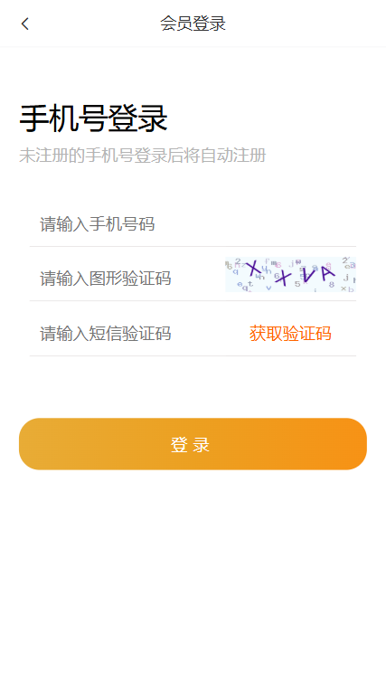

---

---

## 0521 Dev-log

### request模块 - axios封装

**目标：**

使用 axios 来请求后端接口, 一般都会对 axios 进行 一些配置 (比如: 配置基础地址，请求响应拦截器等)

对 axios 进行基本的二次封装, 单独封装到一个 request 模块中, 便于维护使用

[**接口文档地址**](https://apifox.com/apidoc/shared/12ab6b18-adc2-444c-ad11-0e60f5693f66/doc-2221080 "点击进入接口文档")

**基地址：**http://smart-shop.itheima.net/index.php?s=/api/

```
/* 封装axios用于发送请求 */
import axios from 'axios'

// 创建一个新的axios实例
const request = axios.create({
  baseURL: 'http://smart-shop.itheima.net/index.php?s=/api/',
  headers: { platform: 'H5' },
  timeout: 5000
})

// 添加请求拦截器
request.interceptors.request.use(function (config) {
  // 在发送请求之前做些什么
  return config
}, function (error) {
  // 对请求错误做些什么
  return Promise.reject(error)
})

// 添加响应拦截器
request.interceptors.response.use(function (response) {
  const res = response.data
  if( res.status !== 200 ) {
    //! 在请求没有成功时，对用户进行提示
    this.$toast(res.message)
    return Promise.reject(res.message)
  }
  // 对响应数据做点什么
  return response.data
}, function (error) {
  // 对响应错误做点什么
  return Promise.reject(error)
})

export default request
```

---

### 图片验证码功能完成

**需求：**

1. 动态将请求回来的 base64 图片，解析渲染出来
2. 点击验证码图片盒子，要刷新验证码

```
methods: {
                //? 获取图片验证码
                async getPic () {
                    const { data: { base64, key } } = await getPicCode()
                    this.picUrl = base64
                    this.picKey = key
                    //! 提示 from Vant
                    this.$toast.success('获取图形验证码成功!')
                },
```

---

### api 接口模块 - 封装图片验证码接口

**封装api模块的好处：**

1. 请求与页面逻辑分离
2. 相同的请求可以直接复用
3. 请求进行了统一管理

```
import request from "@/utils/request"

//todo 获取图形验证码
export const getPicCode = () => {
    return request.get('captcha/image')
}
```

---

### Toast 轻提醒插件

**目标：阅读Vant文档，掌握 toast 轻提示**

##### 注册安装：

```
// main.js
import Vant from 'vant';

Vue.use(Vant);
```

##### 两种使用方法：

1. 导入调用（**组件内 或 非组件内均可**）

   ```
   import { Toast } from 'vant'
   Toast{'提示内容'}
   ```
2. 通过this直接调用（**必须组件内**）

   本质：将方法，注册挂载到了Vue原型上 Vue.prototype.$toast = xxx

   ```
   this.$toast('提示内容')
   ```

---

### 短信验证倒计时功能实现

**需求：**

1. 点击按钮，实现 倒计时 效果
2. 倒计时之前的 校验处理 (手机号、验证码)
3. 封装短信验证请求接口，发送请求添加提示

```
// 在 methods 中添加

	//? 获取短信验证码
           async getCode () {
            	//! 在获取短信验证码前进行校验
                if( !this.verifyFn() ){
                	return
                 }

                //! 判断定时器是否开启
                if( !this.timer && this.curSeconds === this.totalSeconds ){
                	//todo 发送请求，获取验证码
                        await getMsgCode(this.picCode, this.picKey, this.mobile)
                        this.$toast('发送成功，请注意查收')

                     //todo 开始倒计时
                     this.timer = setInterval( () => {
                         this.curSeconds--
                         if( this.curSeconds <= 0){
                             clearInterval( this.timer )
                             this.timer = null
                             this.curSeconds = 60
                         }
                    }, 1000)
                 }
           },
```

---

### 登录功能实现

**目标：**

**封装api登录接口，实现登录功能**

1. 阅读接口文档，封装登录接口

   ```
   // 于 api/login.js 中配置
   //todo 登录接口
   export const Login = (mobile , smsCode) => {
       return request.post("/passport/login", {
           form: {
               isParty: false,
               partyData: {},
               mobile,
               smsCode
           }
       })
   }
   ```
2. 登录前的校验 (手机号，图形验证码，短信验证码)

   ```
   //? 校验输入框内容
   verifyFn () {
   	if(!/^(?:(?:\+|00)86)?1[3-9]\d{9}$/.test(this.mobile)) {
   		this.$toast('请输入正确的手机号')
   		return false
   	}
   	if (!/^\w{4}$/.test(this.picCode)) {
   		this.$toast('请输入正确的图形验证码')
   		return false
   	}
   	return true
   	},

   //? 登录
   async login () {
   	if (!this.verifyFn()) {
   		 return
            }

           if(!/^\d{6}$/.test(this.msgCode)) {
                 this.$toast('请输入正确短信验证码')
                 return
            }

            const res = await Login(this.mobile, this.msgCode)
            console.log(res)
   }
   ```
3. 调用方法，发送请求，成功添加提示并跳转

---

### 响应拦截器统一处理错误提示

**目标：**

    **通过响应拦截器，统一处理接口的错误提示**

```
// 添加于 utils/request.js

// 添加响应拦截器
request.interceptors.response.use(function (response) {
  const res = response.data
  if( res.status !== 200 ) {
    //! 在请求没有成功时，对用户进行提示
    this.$toast(res.message)
    return Promise.reject(res.message)
  }
  // 对响应数据做点什么
  return response.data
}, function (error) {
  // 对响应错误做点什么
  return Promise.reject(error)
})
```

---

---

## 0522 Dev-log

### 登录权证信息储存

**目标：**

**vuex 构建 user 模块存储登录权证 (token & userId)**

1. token 存入 vuex 的好处，易获取，响应式
2. vuex 需要分模块 => user 模块

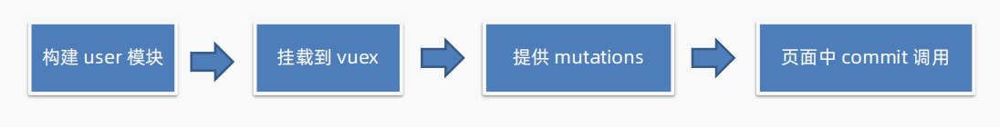

---

### Storage存储模块 - Vuex持久化处理

**目标：**

**封装 storage 存储模块，利用本地存储，进行 vuex 持久化处理**

**原因：**

1. **vuex刷新会丢失数据 → 将数据存入本地**
2. **每次存取操作太麻烦 → 封装 utils/storage 工具**

   ```
   const InfoKey = 'shopping_userInfo'

   // 获取个人信息
   export const getInfo = () => {
       const defaultObj = { token: '', userId: '' }
       const result = localStorage.getItem(InfoKey)
       return result ? JSON.parse( result ) :defaultObj
   }

   // 设置个人信息
   export const setInfo = info => {
       localStorage.setItem( InfoKey, JSON.stringify(info))
   }

   // 删除个人信息
   export const removeInfo = () => {
       localStorage.removeItem( InfoKey )
   }

   ```

---

### 优化：添加请求loading效果

**目标：统一在每次请求后台时，添加 loading 效果**

**背景：**有时候因为网络原因，一次请求的结果可能需要一段时间后才能回来，此时，需要给用户 添加 loading 提示。

**添加 loading 提示的好处：**

1. 节流处理：防止用户在一次请求还没回来之前，多次进行点击，发送无效请求
2. 友好提示：告知用户，目前是在加载中，请耐心等待，用户体验会更好

**实操步骤：**

1. 请求拦截器中，每次请求，打开 loading
2. 响应拦截器中，每次响应，关闭 loading

[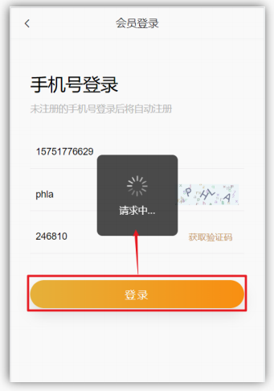]()

---

### 优化：添加页面访问拦截

**目标：基于全局前置守卫，进行页面访问拦截处理**

**说明：**智慧商城项目，大部分页面，游客都可以直接访问, 如遇到需要登录才能进行的操作，提示并跳转到登录

**但是：**对于支付页，订单页等，必须是登录的用户才能访问的，游客不能进入该页面，需要做拦截处理

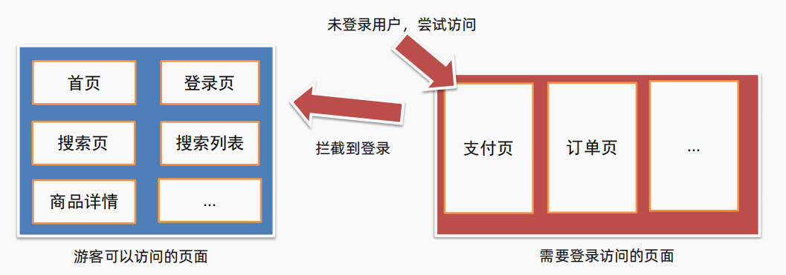

**路由导航守卫 - [全局前置守卫](https://v3.router.vuejs.org/zh/guide/advanced/navigation-guards.html#%E5%85%A8%E5%B1%80%E5%89%8D%E7%BD%AE%E5%AE%88%E5%8D%AB)**

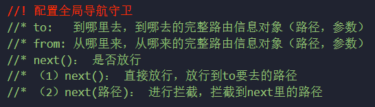

1. 所有的路由一旦被匹配到，都会先经过全局前置守卫
2. 只有全局前置守卫放行，才会真正解析渲染组件，才能看到页面内容

访问权限页面时，拦截或放行的关键点？ → ***用户是否有登录权证 token***

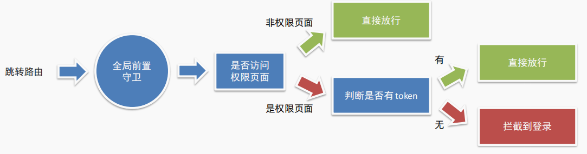

---

### 首页 - 静态结构准备&动态渲染

**目标：实现首页静态结构，封装接口，完成首页动态渲染**

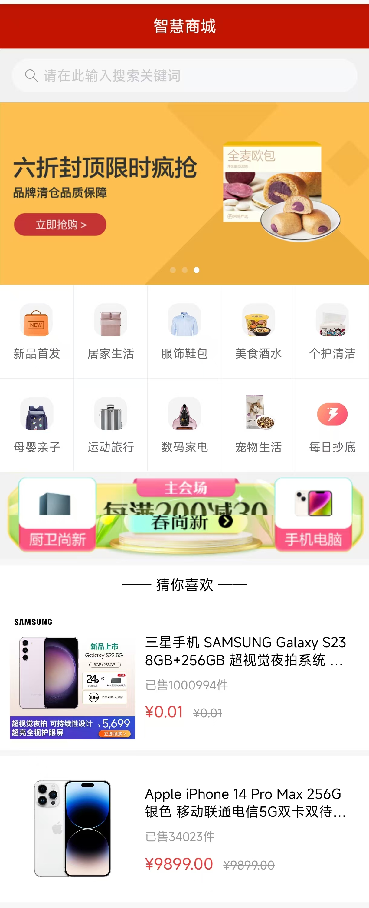

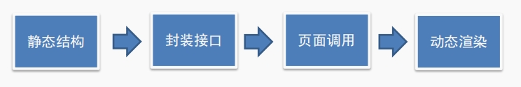

---

### 搜索 - 历史记录管理

**目标：构建搜索页的静态布局，完成历史记录的管理**

**需求：**

1. 搜索历史基本渲染
2. 点击搜索 (添加历史)

   点击 搜索按钮 或 底下历史记录，都能进行搜索

   ① 若之前**没有** 相同搜索关键字，则直接**追加到最前面**

   ② 若之前**已有** 相同搜索关键字，将该**原有关键字移除，再追加**
3. 清空历史：添加清空图标，可以清空历史记录
4. 持久化：搜索历史需要持久化，刷新历史不丢失

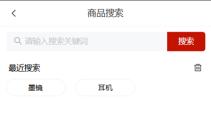

**尝试用vuex解决history (使用todo中的代码实现)**

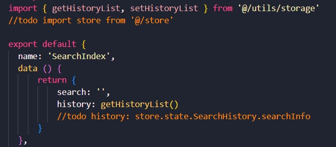

---

---


## 0523 Dev-log

### 搜索列表 - 静态布局 & 动态渲染

**目标：实现搜索列表页静态结构，封装接口，完成搜索列表页的渲染**

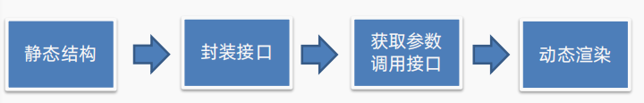

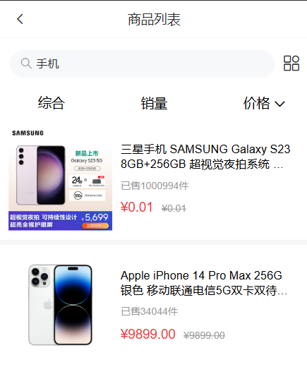

---

### 商品详情 - 静态布局 & 渲染

**目标：实现商品详情静态结构，封装接口，完成商品详情页渲染**

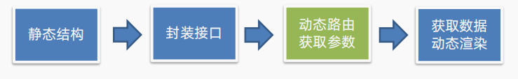

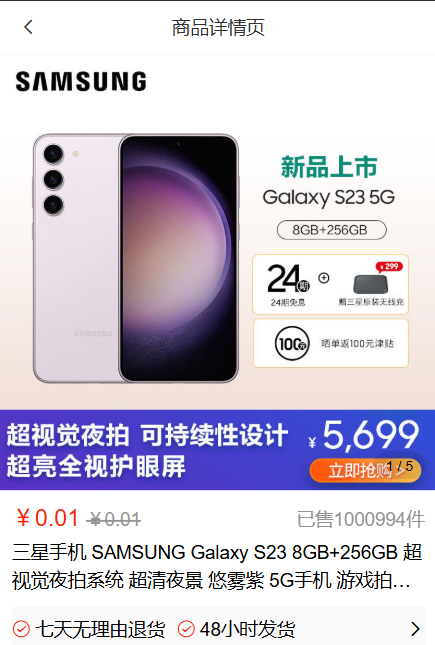

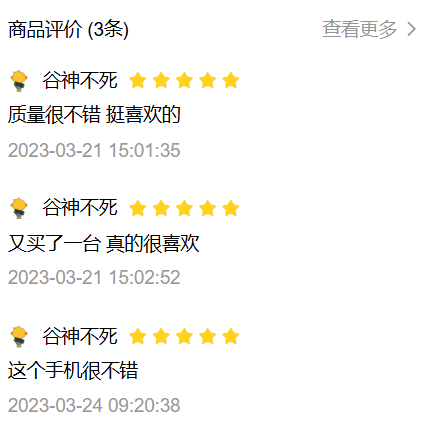

---

### 加入购物车 - 唤起弹层

**目标：点击加入购物车，唤起弹层效果**

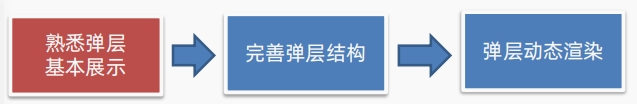

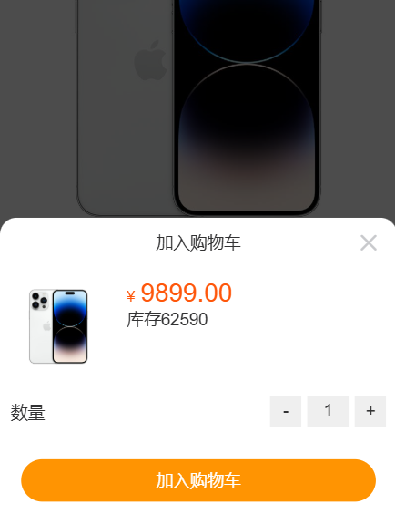

---

### 加入购物车 - 封装数字框组件

**目标：封装弹层中的数字框组件**

**分析：组件名 CountBox**

1. 静态结构，左中右三部分
2. 数字框的数字，应该是外部传递进来的 (**父传子**)
3. 点击 + - 号，可以修改数字 (**子传父**)
4. 使用 **v-model** 实现封装 (:value 和 @input 的简写)
5. 数字不能减到小于 1
6. 可以直接输入内容，输入完成判断是否合法

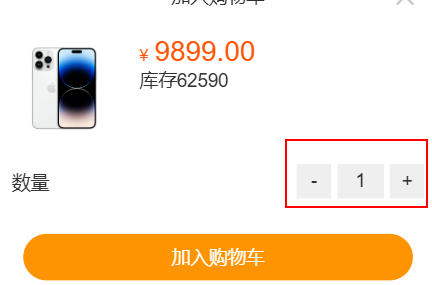

---

### 加入购物车 - 判断 token 添加登录提示

**目标：给未登录的用户，添加登录提示**

**说明：加入购物车，是一个 登录后的用户 才能进行的操作**

**所以需要进行鉴权判断，判断用户 token 是否存在**

1. 若存在：继续加入购物车操作
2. 不存在：提示 用户未登录，引导到登录页，登录完回跳

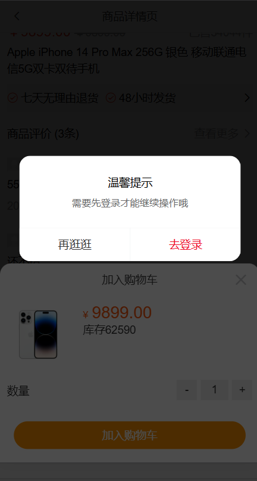
